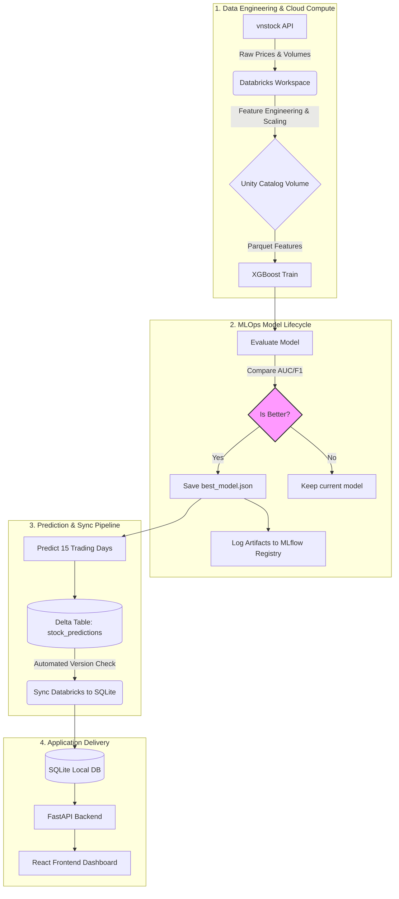

# 📈 Stock Trend Prediction MLOps Pipeline

Dự án xây dựng hệ thống **MLOps Pipeline tự động hóa** nhằm dự báo xu hướng biến động giá của hơn 50 mã cổ phiếu lớn tại thị trường Việt Nam (VN30 & sàn lớn) trong chu kỳ 15 ngày giao dịch tiếp theo. Hệ thống tích hợp xử lý dữ liệu lớn, quản lý vòng đời mô hình và phân phối dịch vụ qua API & Frontend trực quan.

---

## 🛠️ Công Nghệ & Công Cụ Sử Dụng

| Lớp thành phần | Công nghệ / Công cụ chính | Vai trò trong hệ thống |
| :--- | :--- | :--- |
| **Big Data & Compute** | Apache Spark, Databricks | Thu thập, lưu trữ, tiền xử lý và biến đổi đặc trưng phân tán |
| **Machine Learning** | XGBoost Classifier, Scikit-Learn | Huấn luyện mô hình phân loại nhị phân xu hướng TĂNG/GIẢM |
| **MLOps & Tracking** | MLflow | Quản lý vòng đời model, theo dõi hyperparameter, registry & version control |
| **Database Sync** | SQLite, Delta Lake (Databricks) | Đồng bộ dữ liệu dự đoán từ Cloud về Database local phục vụ API |
| **Backend API** | FastAPI (Python), Uvicorn | Xây dựng RESTful API hiệu năng cao phục vụ tra cứu dự đoán |
| **Frontend UI** | React, Vite, Vanilla CSS | Xây dựng dashboard giao diện trực quan hóa đồ thị xu hướng 15 ngày |
| **Containerization** | Docker, Docker Compose | Đóng gói Backend & Frontend chạy đồng nhất trong môi trường ảo hóa |
| **Package Manager** | `uv` | Quản lý cài đặt gói thư viện Python siêu tốc trên Databricks |

---

## 🔄 Luồng Hoạt Động Tổng Thể (System Architecture)

Quy trình vận hành khép kín của hệ thống từ dữ liệu thô đến giao diện người dùng:



### Chi tiết các bước vận hành:
1. **Thu thập & Biến đổi Đặc trưng (Feature Engineering):** Dữ liệu giá được lấy qua `vnstock`, tính toán 17 chỉ báo kỹ thuật nâng cao (các khoảng trễ sinh lời, tỷ lệ MA5/MA10/MA20, RSI, MACD, Volatility, v.v.), chuẩn hóa bằng `MinMaxScaler` và lưu tại Unity Catalog Volume định dạng Parquet.
2. **Huấn luyện & Quản lý Mô hình (MLOps):** Huấn luyện mô hình XGBoost. Kết quả huấn luyện được kiểm thử bằng time-series split (80/20) để tính toán Accuracy, F1-Score, AUC-ROC và log lên MLflow. Nếu mô hình mới tối ưu hơn mô hình cũ, hệ thống sẽ tự động cập nhật `best_model.json` và lưu lại lịch sử đăng ký.
3. **Dự báo chuỗi ngày & Đồng bộ DB (Pipeline):** Chạy dự báo đa ngày (15 ngày giao dịch tiếp theo) bằng mô hình tốt nhất, ghi đè vào Delta table trên Cloud. Script Backend thực hiện kiểm tra lịch sử phiên bảng dữ liệu và đồng bộ tự động về SQLite local qua kết nối bảo mật.
4. **Phân phối ứng dụng (Inference API):** API Backend sử dụng SQLite để phục vụ dữ liệu dự báo tức thì cho Frontend mà không cần load lại mô hình học máy tại runtime, tối ưu hóa tốc độ tải trang.

---

## 📂 Cấu Trúc Thư Mục Rút Gọn

```text
stock-gnn-mlops/
├── backend/               # FastAPI RESTful API & script đồng bộ DB SQLite
├── data_engineering/      # Code thu thập dữ liệu (vnstock), tiền xử lý & tạo feature
├── frontend/              # Giao diện dashboard React/Vite trực quan hóa biểu đồ
├── ml_model/              # Mã nguồn train XGBoost, đánh giá & so sánh baseline models
├── mlops/                 # Code định nghĩa automated pipeline (local & databricks)
├── models/                # Lưu trữ file model.json, metrics đánh giá & biểu đồ so sánh
├── docker-compose.yml     # Khởi chạy đồng bộ Frontend & Backend bằng Docker
└── requirements.txt       # Danh sách thư viện Python cần thiết
```

---

## 🚀 Hướng Dẫn Cài Đặt & Chạy Nhanh

### 1. Chạy bằng Docker (Khuyên dùng)
Yêu cầu máy tính đã cài đặt Docker & Docker Compose.
```bash
# Khởi động đồng thời cả Backend (port 8000) và Frontend (port 5173)
docker-compose up --build
```
*   **API Documentation (Swagger):** `http://localhost:8000/docs`
*   **Frontend Web App:** `http://localhost:5173`

### 2. Thiết lập Local để chạy Pipeline/Train
```bash
# Cài đặt thư viện Python
pip install -r requirements.txt

# Thiết lập file .env cấu hình thông tin kết nối Databricks
cp .env.example .env # Điền Databricks Host và Token của bạn vào file .env

# Chạy huấn luyện và so sánh mô hình thủ công
python ml_model/train.py

# Chạy toàn bộ pipeline MLOps ở local
python mlops/pipeline.py
```

---

## 👥 Thành Viên Nhóm

| Họ và tên               | MSSV     |
|------------------------|----------|
| Võ Đại Phát           | 23672291 |
| Trần Hoàng Xuân Lộc   | 23636491 |
| Phạm Ngọc Toàn        | 23672111 |
| Trần Anh Kiệt         | 23655711 |
| Trần Nguyễn Toàn Phát | 23643121 |
